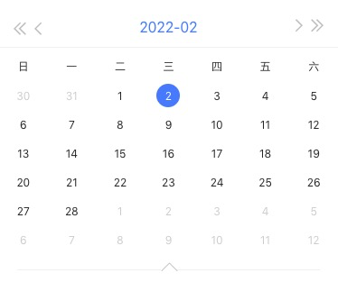
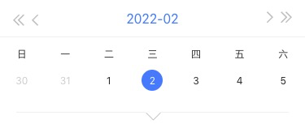
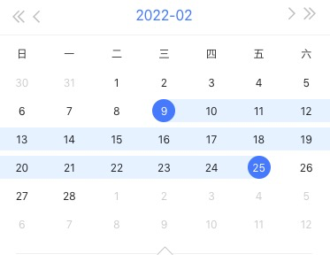
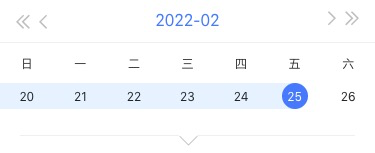

# wh-calender-react

### 简介
* react hooks日历选择组件 
* 自适应尺寸，支持PC、H5 
* 周/月，左右滑动翻页，点击翻页
* 支持单选、多选
* 支持typescript

### 使用
```js
npm install wh-calender-react
```
```jsx
import Calender from 'wh-calender-react'
import 'wh-calender-react/lib/style.css'
```
### 单选
```jsx
<Calender
  dayCheckedCb={dayCheckedCb} // 选中的回调函数
  defaultCheckedDate={new Date('2022-02-02')} // 不传默认显示今天
/>
```



### 多选
```jsx
<Calender
  isRange // 是否是多选
  rangeCheckedCb={rangeCheckedCb} // 选中的回调函数
  defaultCheckedRange={[new Date('2022-02-09'), new Date('2022-02-25')]} // 默认选中的时间段，不传默认不选中
/>
```




